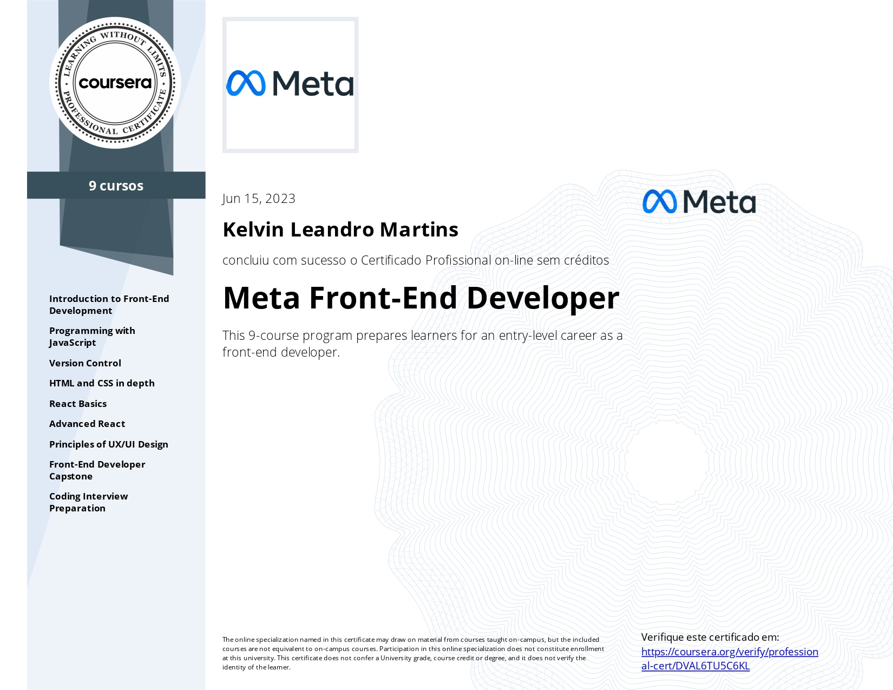

# About this repository
Solved programming exercises and some ungraded labs from **"Meta Front-End Developer"** certification, available on *Coursera*, offered by *Meta*. 

# About the certification
The professional certificate is divided into 9 courses, each one having its own certificate. The courses in this certification:

1. [Introduction to Front-End Development](https://github.com/kelvinleandro/coursera-meta-front-end/tree/main/course%2001%20-%20introduction%20to%20front-end%20development)

2. [Programming with JavaScript](https://github.com/kelvinleandro/coursera-meta-front-end/tree/main/course%2002%20-%20programming%20with%20javascript)

3. Version Control

4. [HTML and CSS in depth](https://github.com/kelvinleandro/coursera-meta-front-end/tree/main/course%2004%20-%20html%20and%20css%20in%20depth)

5. [React Basics](https://github.com/kelvinleandro/coursera-meta-front-end/tree/main/course%2005%20-%20react%20basics)

6. [Advanced React](https://github.com/kelvinleandro/coursera-meta-front-end/tree/main/course%2006%20-%20advanced%20react)

7. [Principles of UX/UI Design](https://github.com/kelvinleandro/coursera-meta-front-end/tree/main/course%2007%20-%20principles%20of%20UX%20UI%20Design)

8. [Front-End Developer Capstone](https://github.com/kelvinleandro/coursera-meta-front-end/tree/main/course%2008%20-%20front-end%20developer%20capstone/capstone-project)

9. Coding Interview Preparation

---

